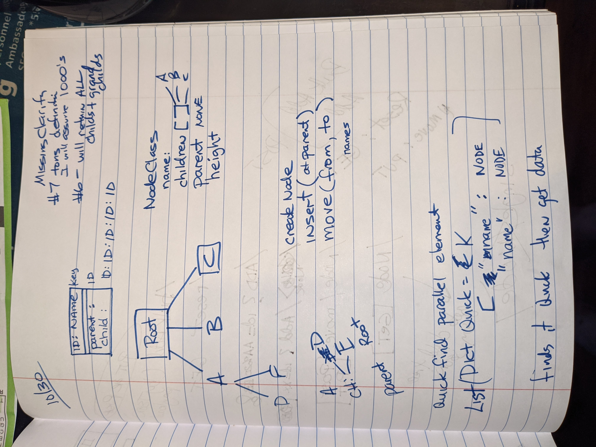

# AWESOME COMPANY API 
* by Todd Lindstrom
* assignment from Treeshift

_Note this project is currently running on an AWS EC2 Instance - The details will be in emails not here in github._

# Requirements Summarized

1. Create a tree based structure for data
2. Create HTTP API to get all descendant nodes of a node
    * reply must include nodeid, parent, root, height
3. Create HTTP API to move one node to another
4. Access must be quick expecting "tons" of nodes
5. Access must be persistent.
6. Operates from dockerfile and docker-compose

## DERIVED REQUIREMENTS
These are the additional constraints that I added. One directly contradicts the wording of the statement of work so I will address that first.

When moving a node to a new parent - you cant move the node to a descendant of yourself.

Implications - this violates the statement of work which says: _the given node can be anyone in the tree structure_

I was able to get initial clarifications from team but secondary requests were not available so I added this derived requirement based on the overriding requirement 1 which states that it must be in a tree format.

If you take a tree like this:

~~~
    A
   B C
  D
 E
F G
~~~

If you try to move B to E then you would get a wraparound effect and the whole B tree would be disconnected from the root and there would be "cross-breeding" pointers that would make it no longer a tree.

Thus in the absence of clarity, I added this derived requirement.

## OTHER DERIVED REQUIREMENTS

2. add a method to add data using a POST (postman)
3. add a root level small HTML message for API syntax
4. add .../debug and other interfaces just for debug purposes.  Normally I would not enable these on production but I wanted you to see some of the thought process involved.
5. For demo simplicity, the MOVE operation is done as a GET.  Actually I believe that a PUT is more appropriate, but it is easier to demo from a browser if its a GET operation.
6. Make it work on AWS EC2. (I do not have a great linux development computer after leaving Cisco so I created a free-tier EC2 VM to use and connected Visual Studio Code to it for access and debug.)

# LEFT TO-DO
I did not do absolutely everything required to make this production ready.  hHre are some todo's that would follow:

## Unit Tests
I did not add any unit tests nor did I use the classical TDD development process. BUT what I did do was test it from the ground up. I first got the Node class created and created the ADD routine.  Then I added persistence (see below).  I did each step and tested it manually. Some of that test code is lost as I was not storing the intermediate files in GIT.  I realize that would have been good for you to see my thought process, but its too late.

## Not near enough comments
I would add more comments to productionize the code. While important, this was not of high importance for a detailed many-hour volunteer assignment like this.

## Production Level Simultaneous Access
In my case I used Flask and Waitress - I figure a debug level of web app is enough for a volunteer work assignment.  I just want to let you know that I did consider the critical section and during the MOVE operation, no read operations can be done (at least from the nodes connected)

## Maybe a better Persistence

I ended up using a file for every node.  There are lots of different ways to achieve persistence: a local database, a cloud database, a binary dump of data, and there may be others. I did not get any clarification on the definition of "ton", so I assume that "ton" will not exceed 2^16-1 (655,535) elements. If that were to be the case, I would modify it to store them in subfolders.

However at some point the application would grow out and probably need a better persistence.

## A better Engine?
Would I use a different web engine?  Maybe.  While I have not had the privilege of working with GO, all of the Cisco microservices that I worked with on my last program all used GO.

## API DESIGN?
I used a predominance of GET operations to make it easy to demo.

## SECURITY
This is not a secure API so adding authentication would be a production step.  I used simple obfuscation in the URL to keep it safe 

## MORE TESTING
I did not have time to do a stress test on this - it could be that when creating thousands of nodes that something would go wrong. I spent many hours on this getting this project to this point. Hopefully a scaling test can be considered the next follow-on work to do if this were a real Awesome Company.

# MY NOTES FOR REFERENCE

~~~

PERSONAL NOTE
~~~

-------

I hope you enjoy picking apart this code. While the initial statement of work was not clear in many areas, I did get some clarifications and I made assumptions about the others.

In a real business case, I would be quick to get clarifications from the customer to make sure we were getting it right.

## Todd Lindstrom
websites:  
  * https://TODDLmusic.com
  * https://myroadtocollege.com   (my wifes company)

